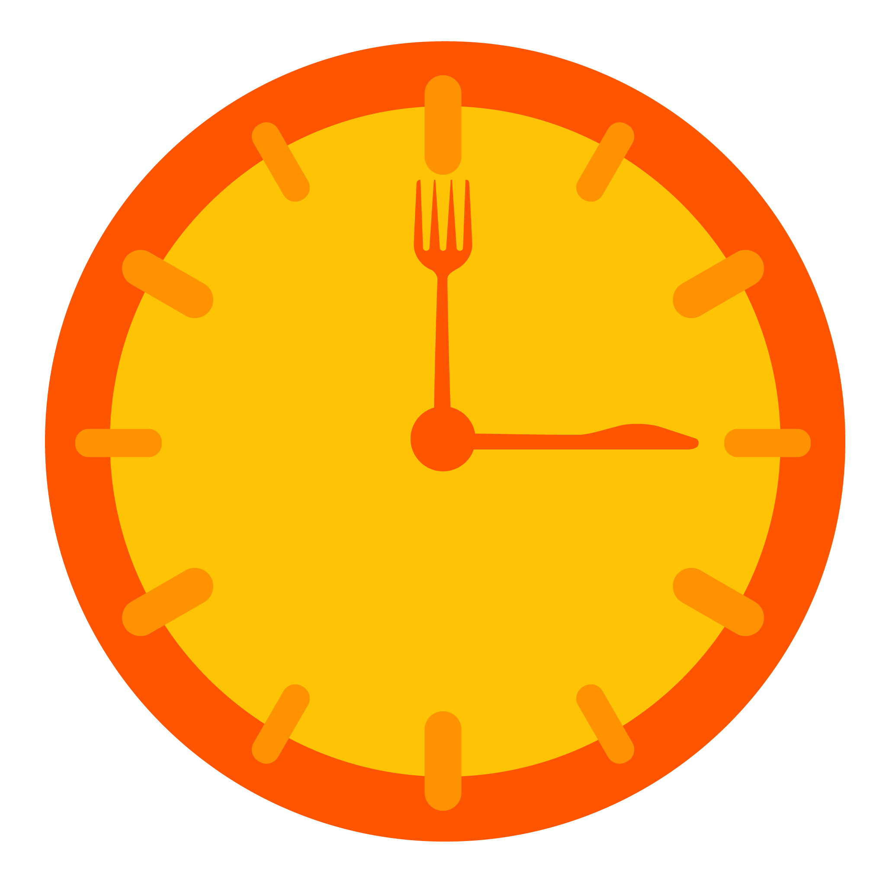
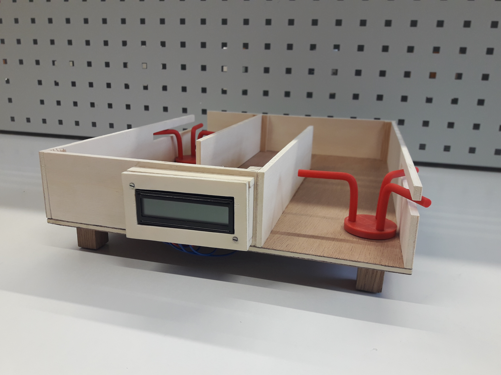

<h1 align="center">TimeToEat Project ⏰</h1>

&nbsp;
&nbsp;
&nbsp;
&nbsp;
&nbsp;
&nbsp;
&nbsp;
&nbsp;
[![Size](https://img.shields.io/github/repo-size/QuentiumYT/TimeToEat?label=Repo%20Size&color=4391BD&logo=data:image/png;base64,iVBORw0KGgoAAAANSUhEUgAAAFAAAABQCAYAAACOEfKtAAAAAXNSR0IArs4c6QAAAARnQU1BAACxjwv8YQUAAAAJcEhZcwAADsMAAA7DAcdvqGQAAAUCSURBVHhe7ZzdbhtFFMfPru3ECSFtYlqhVKK9IQ0Iil0JAilIhSTQPgHPwVWBB2hRVcFzcAG3CNIIJIgrxEeqctPSXvWioh/5aBJok6Zr5r/rTdeb2fjs7tjZmfXvZsdeS9H8dM6cc9aKqUePHjpjNa+5YPbiQtV27Evbjv3x/OeTS823U2E3r8bTlHdZLKeLduPy9PlfK96ddORC4NkL9ZqQNy+WFdvGlhvVou3MffRlfdT9QAqMF4jIcyxrTixHX3zhAM1OvU7PDw3gVo227Pm0kWj0GRhI2wrkTZ54mRCBj7ee0C9/Xqf1jUfilnV127Fmkp6JxgqMkuejSqKRKTx9sX5GyFsQS6k8UO4r0bsnJ5rpjDMxWWExTiAir+RY34rlYLFYoOorx3bJ81Eh0SiBfto2iAYgb3v7KdUXb9KmSNco0ko0RmD4zJt55zUaHhqktY3/6MrVm96HIkgj0QiBsoIx0N8vpByng8PPiRRuXyuTStS+CrertnGJW521jsCgvFKbgsElbiRqKzAs7wmjYHCJI1FLgbsKxtvPCsbPf1ynx5vdk6idQNmZVy57BQMS1/995J5h3ZKolcAPv7hy1nLsulhWxg6N0OQb4ztnXr+72WcSFxZvKEvnU9VxKrh/BxKdr707HtoIdCOP6BvRNrhN8omJl8i2WpuIoERO/8fBaTTo2o3b9NRxxCtr1bHsT707HoXmNdME0nbYnzDuLa/TkcMjVCy0bgGv8f79lXU3ao6OHWreiQ/k/XbtFt25vyJeQZ41O3du8nfvrkfm+8DwmYdWBdUWETYyPESn33rV+6BiOPJAplNYVjDiThhJ4MoDmY1Amby0TTKHOPJAJiMwKE/VhMEhrjyQuSISlocJI6pgqCSJPJApgeG0Rf8FeSgY/zx4SGOHRwlVWDVJ5YHMCJSdeaVSyY28u0trbnN8d0m9xDTyQCYE4juMgmN/L5YHwgXD7+t8ifeW15Slc1p5YN8FIvKKjv2DWLrfYUzVxqlPRF6QoESk84OVDTp2JHmDDFTIA/sqMJC2mZswuOxbHxg+87I2YXDZlz5QVjCyNmFw6XoEyuRltUnm0NUIDMrL+oTBpWtFJCwv6xMGl64IDKetDhMGl44LlJ15OkwYXDoqUOcJg0vHBCLydJ4wuHREYCBttZ0wuCjvA8Nnnq4TBhelTZisYOg6YXBRtiOZPN2bZA5KdhiUZ8qEwSV1EQnLM2XC4JJqh+G0NWnC4JJ4d7Izz6QJg0uineVhwuASe1eIvDxMGFxiCQykrfETBhd2Hxg+80yfMLiwmjVZwTB9wuDSducyeXlpkjnsaSIoL28TBpfIIhKWl7cJg4vURDht8zhhcNllQXbm5XHC4NJiYK+CEWyOVUvUVR7Y2f1e8nzCEpdWzZ0wuOwYEvIuiUsFU0N1Irra+v/MoqL/a5VHy3bD+UAneWDHwOmvfjzYv1nGjPvm0GCZ3js5QeVyn3ezA+geeT4tIdQtiabIA7tysNMSTZIHpIdYpySaJg9EVgHVEk2UByIFAlUSTZUH9hQI0ko0WR5oKxAklWi6PMASCOJKzIM8wBYIuBLzIg/EEgjaScyTPBBbIIiSmDd5IJFAEJZ4qnac/vr7dq7kgcQCgfsruFsWHoHV8PTGcX8aBE9VGjPffTa1iBemk0ogCEZiniLPJ/VXbD998v4q9TXOiOW8js/zevTQGaL/Af3ei59A3O7oAAAAAElFTkSuQmCC)](../../)&nbsp;

## ✨ Introduction

#### TimeToEat is a project for my final high school year exam (June 2019)

The idea for this project came to us when we noted the rather long waiting time in the canteen queue. So we decided to create a system to know the waiting time remaining as well as the number of people in the queue to be able to optimize its passage time.

You can find scripts `python/main.py` alongside `python/constantes.py` used on the raspberry to communicate with LCD and the [website](https://timetoeat.tk), you can always check the code but this project is very specific to a model we've made so you might find it useless.

This was a great first project with 2 of my close friends and we managed to get a good mark for this exam thanks to organization and work we've done :D
